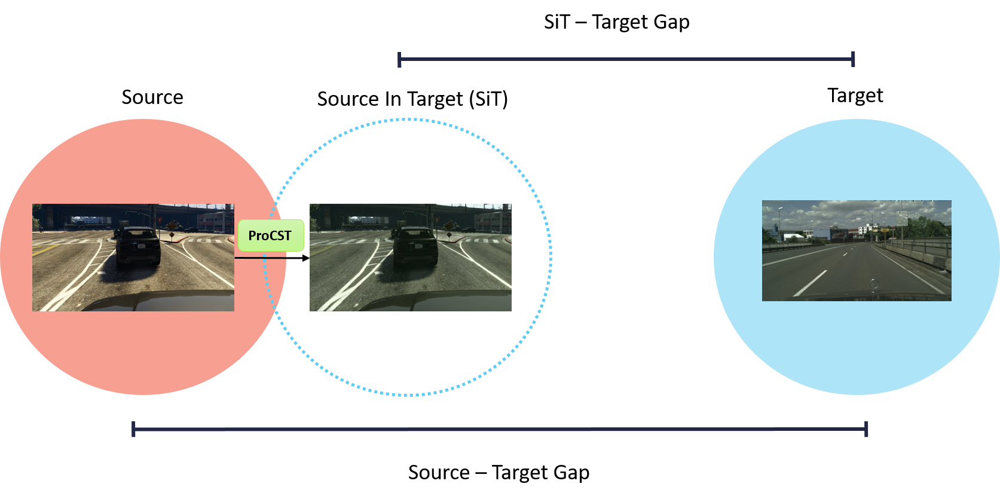
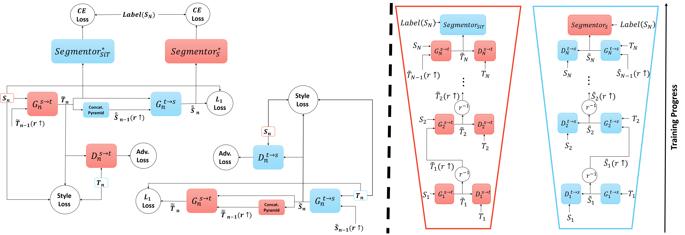

# ProCST: Boosting Semantic Segmentation using Progressive Cyclic Style-Transfer

**[[Arxiv]]()**
**[[Paper]]()** - Coming Soon

In this work, we propose a **novel two-stage framework** for improving unsupervised domain adaptation (UDA) techniques. 

In the first step, we progressively train a multi-scale neural network to perform an initial transfer between the source data to the target data. 
We denote the new transformed data as **"Source in Target" (SiT).**

Then, we use the generated SiT data as the input to any standard UDA approach. 
This new data has a **reduced domain gap** from the desired target domain, and the applied UDA approach **further closes the gap.**

We exhibit the improvement achieved by our framework with two state-of-the-art methods for semantic segmentation, DAFormer and ProDA, on two UDA tasks, GTA5 to Cityscapes and Synthia to Cityscapes. 

This resulted in a *new state-of-the-art performance* on UDA semantic segmentation, in terms of mIoU,  for both GTA5 and Synthia datasets.

The new SOTA checkpoints of ProCST+DAFormer are provided at the bottom of this page.

Translation GIF. Top row: GTA5 &rarr; Cityscapes translation, bottom row: Synthia &rarr; Cityscapes translation
 

## Setup Environment And Datasets

### Environment

Please be sure to install python version >= 3.8. First, set up a new virtual environment:
```shell
python -m venv ~/venv/procst
source ~/venv/procst/bin/activate
```

Clone ProCST repository and install requirements:
```shell
git clone https://github.com/shahaf1313/ProCST
cd ProCST
pip install -r requirements.txt -f https://download.pytorch.org/whl/torch_stable.html
```
### Download Pretrained Networks
Download the pretrained semantic segmentation networks 
trained on the source domain. Please create `./pretrained` folder and save the pretrained networks there.

1. [GTA5 pretrained segmentation net](https://drive.google.com/file/d/1UoWR0oNknGTwAtpBvXorgfkvEhEe4yd6/view?usp=sharing)
2. [Synthia pretrained segmentation net](https://drive.google.com/file/d/1UmwYkC9_qtF8Kahvxk5K_F9HW6T3j1U3/view?usp=sharing)

### Setup Datasets

**Cityscapes:** Please download leftImg8bit_trainvaltest.zip, leftImg8bit_trainextra.zip  and
gt_trainvaltest.zip from [here](https://www.cityscapes-dataset.com/downloads/)
and extract them to `data/cityscapes`. Pay attention to delete the corrupted image 
'troisdorf_000000_000073_leftImg8bit.png' from the dataset, as the link suggests. 

**GTA:** Please download all image and label packages from
[here](https://download.visinf.tu-darmstadt.de/data/from_games/) and extract
them to `data/gta`.

**Synthia:** Please download SYNTHIA-RAND-CITYSCAPES from
[here](http://synthia-dataset.net/downloads/) and extract it to `data/synthia`.

The final folder structure should look like this:

```none
ProCST
├── ...
├── data
│   ├── cityscapes
│   │   ├── leftImg8bit
│   │   │   ├── train
│   │   │   ├── val
│   │   ├── gtFine
│   │   │   ├── train
│   │   │   ├── val
│   ├── gta
│   │   ├── images
│   │   ├── labels
│   ├── synthia
│   │   ├── RGB
│   │   ├── GT
│   │   │   ├── LABELS
├── pretrained
│   ├── pretrained_semseg_on_gta5.pth
│   ├── pretrained_semseg_on_synthia.pth
├── ...
```

## Train ProCST Model
Model is trained using one NVIDIA A6000 GPU with 48GB of memory.

The `--gpus` flag is mandatory. In the command line, insert GPU number instead of `gpu_id`. 
For example, if we chose to train on GPU number 3, we should enter `--gpus 3`.

#### GTA5 &rarr; Cityscapes:
```shell
python ./train_procst.py --batch_size_list 32 16 3 --gpus gpu_id
```

#### Synthia &rarr; Cityscapes:
```shell
python ./train_procst.py --source=synthia --src_data_dir=data/synthia --batch_size_list 32 16 3 --gpus gpu_id
```


## Boosting UDA methods
After training a full ProCST model, we are ready to boost the performance of UDA methods. 
For your convenience, we attach ProCST pretrained models:
1. [ProCST GTA5&rarr;Cityscapes pretrained model](https://drive.google.com/file/d/1kmdzRE_WYafPkV9GsqP-kfCF1-wxF577/view?usp=sharing)
1. [ProCST Synthia&rarr;Cityscapes pretrained model](https://drive.google.com/file/d/1kwXuVhA5Ucdy39fGFzqu_V_Lp-smvbQE/view?usp=sharing)

First, we will generate the SiT Dataset using the 
pretrained models. 
Please enter the path to the pretrained model in the `--trained_procst_path` flag,
and choose the output images folder using the `--sit_output_path` flag.

#### GTA5 &rarr; Cityscapes:
```shell
python ./create_sit_dataset.py --batch_size=1 --trained_procst_path=path/to/pretrained_sit_model --sit_output_path=path/to/save/output_images --gpus gpu_id
````

#### Synthia &rarr; Cityscapes:
```shell
python ./create_sit_dataset.py --source=synthia --src_data_dir=data/synthia --batch_size=1 --trained_procst_path=path/to/pretrained_sit_model --sit_output_path=path/to/save/output_images --gpus gpu_id
```

After successfully generating SiT dataset, we can now replace the original source images 
with the resulting SiT images. Segmentation maps remain unchanged due to the Content 
Preservation property of ProCST. 

We tested our SiT datasets on two state-of-the-art UDA methods:
[DAFormer](https://github.com/lhoyer/DAFormer) and [ProDA](https://github.com/microsoft/ProDA).

Both methods were boosted due to our SiT dataset, and thus resulted in a new state-of-the-art UDA accuracy in terms of mIoU. Results detailed in the paper.

## SOTA Checkpoints: ProCST + DAFormer
We provide new SOTA checkpoints of the combined ProCST+DAFormer, trained on 
GTA5&rarr;Cityscapes and Synthia&rarr;Cityscapes. Results can be tested on Cityscapes validation set.

1. [GTA5&rarr;Cityscapes](https://drive.google.com/file/d/1z0frfWkEmEUACdEIazUsX1zdIPrXlcqJ/view?usp=sharing) checkpoint: 69.5% mIoU
2. [Synthia&rarr;Cityscapes](https://drive.google.com/file/d/1wSp_iszCCpQcfXblGdfl-8bCVb7kkweL/view?usp=sharing) checkpoint: 62.4% mIoU

In order to evaluate results using the above checkpoints, please refer
to the original [DAFormer repository](https://github.com/lhoyer/DAFormer).  After setting up the required environment, 
use the given checkpoints as an input to test shell script:
```shell
cd path/to/DAFormer/directory
cd work_dirs # if this directory does not exits, than please create it.
# download checkpoint .zip file and unzip it in this directory.
chmod +w path/to/checkpoint_directory
cd path/to/DAFormer/directory
sh test.sh path/to/checkpoint_directory
```


## Acknowledgements
This project uses on the following open-source projects. We thank their authors for making the source code publically available.
* [DAFormer](https://github.com/lhoyer/DAFormer)
* [ProDA](https://github.com/microsoft/ProDA)
